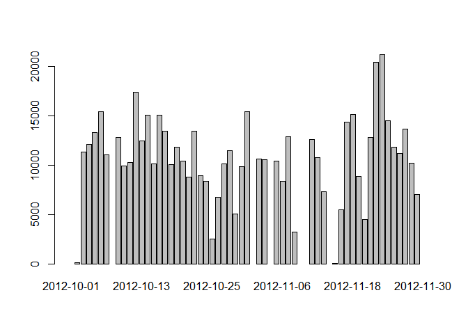
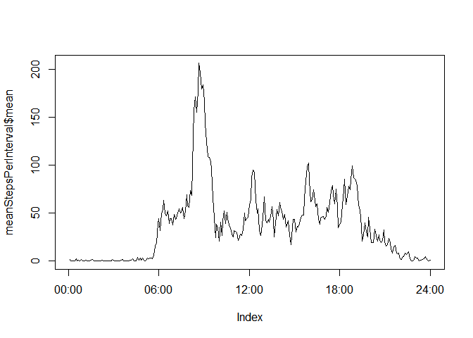

# Reproducible Research: Peer Assessment 1


## Loading and preprocessing the data

```r
library(dplyr)
```

```
## 
## Attaching package: 'dplyr'
## 
## The following object is masked from 'package:stats':
## 
##     filter
## 
## The following objects are masked from 'package:base':
## 
##     intersect, setdiff, setequal, union
```

```r
unzip("activity.zip")
activity <- read.csv("activity.csv")
activity$date <- as.Date(activity$date, format = "%Y-%m-%d")

activity %>% group_by(date) %>% summarise(sum=sum(steps))
```

```
## Source: local data frame [61 x 2]
## 
##          date   sum
## 1  2012-10-01    NA
## 2  2012-10-02   126
## 3  2012-10-03 11352
## 4  2012-10-04 12116
## 5  2012-10-05 13294
## 6  2012-10-06 15420
## 7  2012-10-07 11015
## 8  2012-10-08    NA
## 9  2012-10-09 12811
## 10 2012-10-10  9900
## ..        ...   ...
```
## What is mean total number of steps taken per day?

```r
#activity %>% group_by(date) %>% summarise(sum=sum(steps))

activityByDate <- group_by(activity, date)
stepsPerDay <- summarise(activityByDate, sum=sum(steps))
barplot(stepsPerDay$sum,  names.arg = stepsPerDay$date)
```

 

```r
mean(stepsPerDay$sum, na.rm = T)
```

```
## [1] 10766.19
```

```r
median(stepsPerDay$sum, na.rm = T)
```

```
## [1] 10765
```

## What is the average daily activity pattern?

```r
meanStepsPerInterval <- activity %>% group_by(interval) %>% summarise(mean=mean(steps, na.rm = T))
 plot(meanStepsPerInterval$mean, type="l", xaxt="n")
numIntervals <- length(unique(activity$interval))
axis(side=1, at=c(0, 0.25, 0.5, 0.75, 1)*numIntervals, labels=c("00:00", "06:00", "12:00", "18:00", "24:00"))
```

 

```r
maxStepsInterval <-  meanStepsPerInterval[meanStepsPerInterval$mean==max(meanStepsPerInterval$mean),]$interval
maxHour <- maxStepsInterval %/% 100
maxMinute <- maxStepsInterval %% 100
maxStepsInterval
```

```
## [1] 835
```

The 5-min interval with maximum number of steps begins at 8:35 (code: &#96;r I(maxHour)&#96; : &#96;r I(maxMinute)&#96; ). 

## Imputing missing values

Total number of missing values:


```r
dim(activity[is.na(activity$steps),])[1]
```

```
## [1] 2304
```


## Are there differences in activity patterns between weekdays and weekends?
